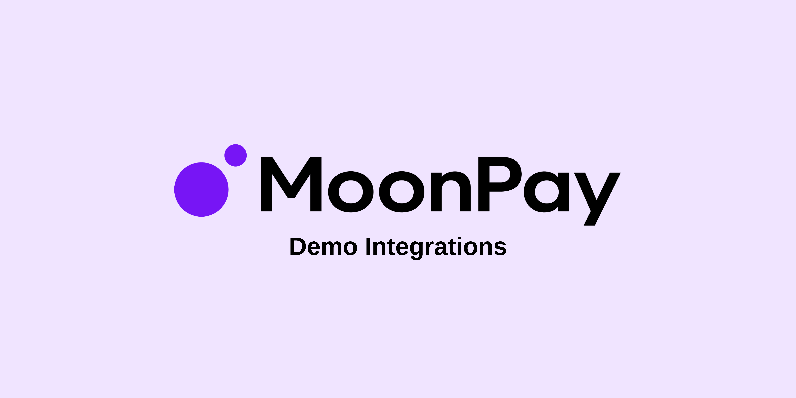

<p align="center">
  
</p>

# MoonPay Demo Integrations

> ⚠️ **Disclaimer:** This repository contains example/sample code for demonstration and testing purposes only. It should **not** be considered production-ready. Use at your own risk and always perform a thorough security review before deploying any code to production.

A monorepo of demo projects showing how to integrate [MoonPay](https://www.moonpay.com/) widgets for buying and selling cryptocurrency. Each project demonstrates a different SDK or integration pattern.

## Projects

| Project | Stack | Description |
|---------|-------|-------------|
| `moonpay-nextjs-buy-and-sell` | Next.js 16 + MoonPay React SDK | Full buy and sell interface with live CoinGecko market data, currency filtering, and server-side URL signing |
| `moonpay-react-buy` | React SDK | Buy crypto widget using `@moonpay/moonpay-react` |
| `moonpay-react-sell` | React SDK | Sell crypto widget using `@moonpay/moonpay-react` |
| `moonpay-websdk-buy` | Web SDK | Buy crypto widget using `@moonpay/moonpay-js` (vanilla JS) |
| `moonpay-websdk-sell` | Web SDK | Sell crypto widget using `@moonpay/moonpay-js` (vanilla JS) |
| `moonpay-react-sell-oninitiatedeposit` | React SDK | Sell widget with `onInitiateDeposit` callback + MetaMask wallet signing |
| `server` | Node.js | Shared HMAC-SHA256 URL signing server for non-Next.js demos |

## Quick Start

### Prerequisites

- Node.js 18+
- npm 9+
- A MoonPay developer account ([dashboard.moonpay.com](https://dashboard.moonpay.com/developers))
- A CoinGecko API key ([coingecko.com/en/api](https://www.coingecko.com/en/api)) — required for the Next.js project

### 1. Install dependencies

```bash
npm install
```

This installs dependencies for all workspaces in one command.

### 2. Configure environment variables

#### Next.js project (moonpay-nextjs-buy-and-sell)

```bash
cp moonpay-nextjs-buy-and-sell/.env.example moonpay-nextjs-buy-and-sell/.env.local
```

Fill in your keys in `.env.local`:

```env
NEXT_PUBLIC_BASE_URL=http://localhost:3000

MOONPAY_API_KEY=pk_test_
MOONPAY_SECRET_KEY=sk_test_
COINGECKO_API_KEY=CG-
COINGECKO_BASE_URL=https://api.coingecko.com/api/v3
```

> All keys except `NEXT_PUBLIC_BASE_URL` are server-only — they are never bundled into client code.

#### Other demo projects (React / WebSDK)

```bash
cp server/.env.example server/.env
cp moonpay-react-buy/.env.example moonpay-react-buy/.env
cp moonpay-react-sell/.env.example moonpay-react-sell/.env
```

At minimum, set your `MOONPAY_SECRET_KEY` in `server/.env`:

```
MOONPAY_SECRET_KEY=sk_test_your_secret_key_here
```

### 3. Start a project

#### Next.js project

No separate signing server needed — signing is handled internally via a Next.js Route Handler.

```bash
npm run start:nextjs
```

Open [http://localhost:3000](http://localhost:3000).

#### Other demo projects

Start the shared signing server first:

```bash
npm run start:server
```

Then in a separate terminal, run any of:

```bash
npm run start:react-buy           # React buy widget (port 3000)
npm run start:react-sell          # React sell widget (port 3000)
npm run start:websdk-buy          # WebSDK buy widget (port 8080)
npm run start:websdk-sell         # WebSDK sell widget (port 8080)
npm run start:react-sell-deposit  # React sell + onInitiateDeposit (port 3000)
npm run start:wallet-page         # MetaMask wallet signing page (port 3001)
```

## How URL Signing Works

MoonPay requires widget URLs to be signed with HMAC-SHA256 to prevent parameter tampering. The secret key must never be exposed in frontend code.

```
1. Frontend builds a widget URL with parameters (walletAddress, amount, etc.)
2. The apiKey is stripped from the URL before it leaves the client
3. The URL is sent to the signing endpoint (/api/sign-url or the Express server)
4. The server re-injects the apiKey from the environment, then signs with HMAC-SHA256
5. The signature is returned to the frontend and passed to the MoonPay SDK
```

The Next.js project handles this entirely within Next.js Route Handlers. The other demos use the shared Express signing server in `server/`.

## Ports

| Service | Port | Notes |
|---------|------|-------|
| Next.js project | 3000 | Built-in signing via Route Handler — no separate server needed |
| Signing server | 5000 | For non-Next.js demos. Configurable via `PORT` env var |
| React demos | 3000 | Vite dev server |
| Hosted wallet page | 3001 | For onInitiateDeposit flow |
| WebSDK demos | 8080 | live-server |

## Available Scripts

All scripts can be run from the repo root:

```bash
npm run setup                     # Install all dependencies
npm run start:nextjs              # Start the Next.js buy and sell project
npm run start:server              # Start the shared signing server
npm run start:react-buy           # Start React buy demo
npm run start:react-sell          # Start React sell demo
npm run start:websdk-buy          # Start WebSDK buy demo
npm run start:websdk-sell         # Start WebSDK sell demo
npm run start:react-sell-deposit  # Start React sell + deposit demo
npm run start:wallet-page         # Start wallet signing page
npm run build                     # Build all projects
npm run test                      # Run tests across all workspaces
npm run clean                     # Remove all node_modules, dist, and .next folders
```

## Tech Stack

- **Next.js project**: Next.js 16 + React 19 + `@moonpay/moonpay-react` + CoinGecko API + Tailwind CSS v4
- **React SDK demos**: [Vite](https://vite.dev/) + React 18 + `@moonpay/moonpay-react`
- **Web SDK demos**: Vanilla JS + `@moonpay/moonpay-js` via CDN
- **Signing server**: Express.js + `dotenv` + Node.js `crypto`
- **Monorepo**: npm workspaces
