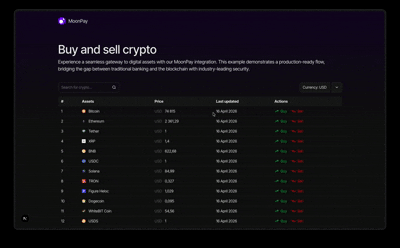

<p align="center">
  
</p>

# MoonPay Next.js Buy & Sell

A crypto buy and sell interface built with Next.js 16, MoonPay, and CoinGecko. Users can browse live crypto prices, filter by currency, search for assets, and trigger buy/sell flows via the MoonPay widget — all with API keys kept securely server-side.

## Tech Stack

- **[Next.js 16](https://nextjs.org)** — App Router, Server Components, Route Handlers
- **[MoonPay React SDK](https://www.npmjs.com/package/@moonpay/moonpay-react)** — Buy and sell widget
- **[CoinGecko API](https://www.coingecko.com/en/api)** — Live crypto prices, logos, and metadata
- **[Tailwind CSS v4](https://tailwindcss.com)** — Styling
- **[React Icons](https://react-icons.github.io/react-icons)** — Icon set
- **TypeScript** — Full type safety

## Features

- Live crypto market data fetched server-side on initial load
- Filter by currency and search by coin name — both trigger a fresh API call
- MoonPay buy and sell widget with server-side URL signing (secret key never exposed)
- All sensitive API keys are server-only — never bundled into client code

## Getting Started

### 1. Clone the repo and install dependencies

```bash
npm install
```

### 2. Set up environment variables

Copy the example env file and fill in your keys:

```bash
cp .env.example .env.local
```

| Variable | Description | Where to get it |
|---|---|---|
| `NEXT_PUBLIC_BASE_URL` | Your app's base URL | `http://localhost:3000` for dev |
| `MOONPAY_API_KEY` | MoonPay publishable key | [dashboard.moonpay.com](https://dashboard.moonpay.com) |
| `MOONPAY_SECRET_KEY` | MoonPay secret key for URL signing | [dashboard.moonpay.com](https://dashboard.moonpay.com) |
| `COINGECKO_API_KEY` | CoinGecko API key | [coingecko.com/en/api](https://www.coingecko.com/en/api) |
| `COINGECKO_BASE_URL` | CoinGecko base URL | `https://api.coingecko.com/api/v3` |

### 3. Run the development server

```bash
npm run dev
```

Open [http://localhost:3000](http://localhost:3000) in your browser.

## Security

MoonPay requires all widget URLs to be signed with your secret key (HMAC-SHA256). This signing happens in a Next.js Route Handler (`/api/sign-url`) so the secret key never leaves the server. The client strips the `apiKey` from the URL before sending it to be signed, and the server re-injects it from the environment before generating the signature.

CoinGecko requests are also proxied through a Route Handler (`/api/crypto`) — the API key is injected server-side and never appears in client network requests.

## Scripts

```bash
npm run dev      # Start development server (Turbopack)
npm run build    # Build for production
npm run start    # Start production server
npm run lint     # Run ESLint
```

## Deployment

Deploy to [Vercel](https://vercel.com) with zero config — it natively supports the Next.js App Router. Add your environment variables in the Vercel dashboard under **Settings → Environment Variables**. Make sure none of the server-only keys have the `NEXT_PUBLIC_` prefix.
